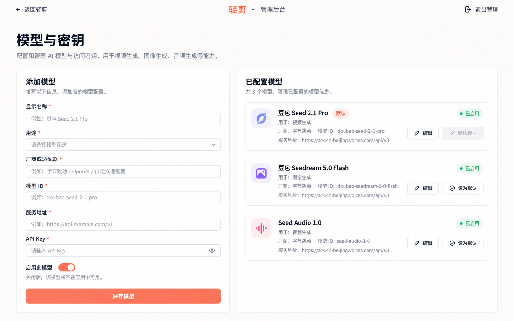

# 轻剪 H5 · 产品需求文档

版本：开发验收稿（2026-09-26）

## 1. 产品目标与范围

轻剪面向希望快速制作短视频的用户。用户在 H5 中添加本地视频、图片和音频，通过智能对话提出分镜拆解、镜头拼接、背景音乐、口播和成片生成要求；视频详情页展示剪辑拼接结果，用户继续用对话提出修改意见，最后预览并下载视频。**对话是所有剪辑与生成操作的核心联路和主入口。**界面保持暖白底色、石墨色文字、珊瑚橙主操作色和移动端单列布局。

**实现状态：**本次开发已接入服务端 Pi Agent、图片与口播模型、异步任务、FFmpeg 切镜检测与导出、背景音乐混音、Logo 菜单及其子页面，并提供模型管理后台。测试部署以 Basic Auth 保护单用户数据。原型仍无账号登录、跨设备同步或画面语义理解；一条复合指令目前只创建一个主任务，复杂请求宜分步发送。详细证据和差距见[体验验收记录](ACCEPTANCE.md)。

### 1.1 智能交互设计理念

参考 ChatGPT 移动端和 Meta Muse AI 的会话式、多模态体验，以**持续对话**承载从素材理解、方案调整到成片交付的完整过程。用户用自然语言描述目标，Agent 返回可查看的方案、素材、口播、图片或视频卡片，并给出与当前结果相关的下一步建议。文字、附件、快捷指令和结果反馈都汇入同一条会话，避免跳到独立的剪辑或生成流程。

**会话即创作主题（Topic）：**用户可为不同视频或创作目标建立独立会话。第一条消息自动成为会话标题；继续在同一会话提问时，Agent 读取该会话最近的消息和当前剪辑方案，沿用该会话的口播、BGM 与成片版本。切换到旧会话可接着修改，创建新会话则从新的对话上下文开始。素材库是全局共享资源，可在不同会话中选用；一个会话的消息、方案和生成结果不会自动作为另一会话的对话记忆。模型调用受上下文窗口限制，当前实现只传入最近若干条消息，不承诺无限长度记忆。

- **先理解，再执行：**缺少素材、片段范围或风格等关键条件时，Agent 用简短问题澄清；可直接执行的任务显示将要使用的素材与预期产物。耗时生成以明确状态告知用户，不把计划或示例误报为已完成结果。
- **结果可追溯、可迭代：**每次剪辑方案、口播、图片和成片都对应触发它的消息与版本。用户可针对具体结果继续说“把第二段缩短”或“这张图换成暖色”，Agent 沿用当前会话上下文更新对应产物。
- **对话主导，预览辅助：**时间线、音频播放器和图片预览帮助用户判断结果；需要修改或重新生成时，用户回到输入框描述意图。快捷操作可预填指令，但须由用户发送后才执行。

### 1.2 移动端设计理念

采用单列内容流与底部常驻输入框，优先呈现当前对话和最新产物。素材、图片、音频、视频以可点击卡片展示，长内容按需展开；次级页面从 Logo 菜单进入，返回后保留会话位置与未发送草稿。在当前页面切换会话时，未发送草稿按会话暂存，切回后恢复；刷新页面后草稿暂不保留。按钮和卡片提供适合手指操作的点击区域，输入框在软键盘弹出时仍可见，并适配安全区与不同屏宽。上传和生成任务在离开当前页面后仍可查看进度；弱网或失败时保留输入和已完成结果，提供重试。对话背景图片不得降低文字、状态与控件的可读性。

## 2. 信息架构与 Logo 菜单

首页顶栏的「轻剪」Logo 是菜单按钮。点击后从左侧弹出菜单抽屉，页面其余区域出现半透明遮罩；再次点击 Logo、点击遮罩、选择菜单项或按返回键时关闭菜单。菜单展示最近会话，可直接切换主题；「查看全部」进入会话历史页。对话顶栏下方显示当前会话标题，点击同样进入会话历史。切换页面时保留当前会话和未发送的对话草稿。

| 菜单项 | 页面与主要内容 |
| --- | --- |
| 对话 | 返回主对话工作区并继续当前会话。 |
| 素材库 | 按视频、图片、音频查看已导入素材；预览、选择加入当前对话、移除素材。 |
| 成片库 | 查看已生成的视频及版本；播放、进入剪辑拼接页、下载。生成中的任务显示状态。 |
| 会话历史 | 按最近更新时间查看创作主题、最近一条消息、消息数和当前会话标记；点击后切换并继续该会话的消息、方案和生成结果。 |
| 用户中心 | 展示用户资料与登录状态；访客状态提供登录入口。 |
| 设置 | 选择默认对话模型、切换界面语言、查看用户协议与隐私政策、设置对话区域的背景图片。 |

管理后台位于独立的 `/admin` 路径，通过本机管理员令牌进入。管理员可维护文本、图片、口播模型的厂商、用途、模型 ID、服务地址、启用状态与 API Key，并设置新对话默认文本模型。后台读取接口仅返回密钥是否已设置，不回传完整 API Key；密钥只在服务端加密存储和使用。

菜单中的素材库、成片库和历史记录应有明确空状态与返回对话入口。素材库用于选择素材，成片库用于查看和下载结果；剪辑、口播、重新生成等请求统一回到对话提交。删除素材或成片时需确认，并说明是否会影响已有方案或导出文件。

设置页列出当前可用的 Pi Agent 对话模型，用户可选择默认模型；选择被保存并应用于之后新建的会话，已有会话保留其原模型。此设置只决定对话理解与剪辑规划所用模型，不替换口播音频和图片生成的专用模型。设置页还提供语言选择，切换后界面文案立即更新，并在再次打开页面时保持选择。用户协议和隐私政策分别进入可阅读的独立页面。对话背景图片可从预设图片或本地图片中选择，支持预览和恢复默认；该设置只影响对话区域的显示，不会成为剪辑素材或进入导出视频。背景图片下的消息文字与输入框应保持清晰可读。

## 3. 核心流程

1. 进入「对话」工作区，添加视频；系统检测切镜点，在素材预览中显示最多 8 个分镜缩略图与时间范围。也可从「素材库」选择已有素材。
2. 在底部输入框描述要求，可附加本地图片作为封面或视觉参考。发送后，图片缩略图与文字一起进入对话消息。
3. Pi Agent 根据用户要求、可用素材与切镜时间点生成结构化剪辑方案；界面显示片段顺序、时长、画幅与视频预览。用户通过继续发消息调整方案。
4. 用户可在对话中要求生成口播。页面返回可阅读的口播文本，并生成独立音频供试听和下载。
5. 用户也可在对话中要求生成封面或视觉素材图片，预览结果后继续通过对话调整，或将其用于当前方案。
6. 用户可在对话中要求搜索 BGM。Pi Agent 提取音乐风格关键词，返回 Pixabay、24bit 的原站搜索入口；用户在原站试听、确认使用权并下载，然后上传 MP3/WAV/OGG 音乐，在对话中指定为 BGM。明确提供的 Pixabay 官方 CDN MP3 下载链接可由服务端校验并导入。未上传音乐时可选择内置轻快合成配乐。点击视频预览或成片卡片，进入「剪辑拼接」详情页查看片段与音轨；如需裁剪、分割、排序或配音，仍通过对话发送要求。两站目前没有已验证的、可供轻剪稳定调用的开放音乐搜索 API，因此站点曲目列表不直接嵌入 H5，详见[BGM 来源调查](BGM_SOURCE_RESEARCH.md)。
7. 用户在对话中发出生成或重新生成指令，Pi Agent 启动任务。成片完成后可播放、下载到本地，并在「成片库」中找到对应版本。

## 4. 原型图与页面需求

### 4.1 对话首页与成片预览

首页依次展示顶栏 Logo 与历史入口、素材区、对话区、片段轨道、视频预览、下载入口，以及底部常驻输入框。素材不足时使用明确的示例标识；只有实际生成完成后才开放下载。点击视频预览进入剪辑拼接详情页。原型图中的「生成成片」按钮属于早期展示稿；正式交互应改成把「生成成片」写入输入框的快捷提示，用户发送消息后才启动生成。

### 4.2 输入指令并附加本地图片

输入框的图片按钮可从本地设备或素材库选择图片。附件在输入框**内部**显示缩略图、文件名、来源和移除按钮；文字指令与附件可同时编辑。发送前移除附件不会删除素材库中的原文件。发送失败时保留已输入文字和附件，便于重试。图片作为封面或视觉参考的用途由用户指令确定，不能默认为视频片段。

### 4.3 口播文案与独立音频试听

口播结果分为「口播文案」和「独立音频」两个对象。文案完整可读；音频卡片显示文件名、播放/暂停、进度、时长和下载入口。用户可先试听独立音频，再通过对话决定是否把它加入成片或要求重做。音频生成中、失败和可播放状态需分别显示；音频失败不应丢失已生成的文案。

### 4.4 对话生成图片

用户可要求生成封面、插图或视频所需的视觉素材。Agent 在对话中返回图片卡片，支持预览、保存至素材库，并根据后续指令重新生成或调整。图片进入剪辑方案的用途由用户意图和方案明确标注；生成失败时保留请求与已有素材，便于重试。

### 4.5 点击视频查看剪辑拼接结果

详情页提供视频预览、播放控制、时间刻度、片段轨道、播放头和独立口播音轨，帮助用户看清当前拼接结果。时间线允许选中片段查看信息、定位和预览，但不直接拖拽裁剪或修改内容。原型图底部的裁剪、分割、排序、配音图标在正式交互中是**对话快捷指令**：点击后把相应意图填入对话输入框，用户补充细节并发送，由 Pi Agent 更新方案。原型图中的「保存并生成」按钮需替换为对话输入/发送入口；只有发送生成指令后才创建新的成片版本。返回对话页时保留当前上下文。

### 4.6 模型管理后台

后台采用与 H5 一致的暖白和珊瑚橙风格，分别呈现现有模型与编辑表单。保存后模型可用于后续任务；修改默认文本模型仅影响新建会话。没有密钥或已禁用的模型不应被普通用户选为默认模型。

## 5. 功能验收要点

| 功能 | 可观察的验收结果 |
| --- | --- |
| Logo 菜单 | 点击 Logo 显示上述六个入口；遮罩、返回键和导航行为正确；当前项有选中状态。 |
| 素材库 | 视频、图片、音频能分类查看；选择图片后，输入框内出现正确缩略图与文件名。 |
| 分镜与背景音乐 | 上传视频显示自动切镜时间点和代表帧；对话可引用镜头并确定拼接顺序。BGM 搜索给出两站入口；用户下载后上传音频，或提供受校验的 Pixabay 官方 MP3 链接。已选音频或内置配乐在导出 MP4 中形成真实音轨，可预览与下载。 |
| 对话方案 | 方案只能引用真实素材，片段时间不越界；裁剪、分割、排序和生成都由发送对话消息触发。 |
| 口播输出 | 文案可阅读；独立音频可播放、暂停、拖动进度并下载；失败可重试。 |
| 图片生成 | 可从对话发起，结果可预览、保存到素材库并通过后续消息迭代；失败不丢失请求与已有素材。 |
| 剪辑拼接 | 可选中片段并定位预览；工具图标只填入对话快捷指令，发送后由 Pi Agent 更新片段与音轨；不提供绕过对话的直接编辑或生成操作。 |
| 成片库 | 生成中显示任务状态，成功后能预览、回到对话继续调整及下载对应 MP4。 |
| 用户中心与设置 | 入口可访问；访客状态明确；默认对话模型可选且新会话使用所选模型；语言切换后界面文案更新且选择得以保留；用户协议和隐私政策可分别打开；对话背景图片可预览、更换和恢复默认，且不影响成片。 |

## 6. 数据与实现约束

- 核心对象包括素材、对话会话、会话模型、消息附件、剪辑方案、口播文案、独立音频、生成图片、导出任务和成片版本；每次方案调整与生成结果都应关联触发它的对话消息，素材 ID 与成片版本应稳定关联。
- Harness 使用 Pi Agent。Agent Loop 在服务端读取会话上下文、选择并调用受校验的工具、检查结果，再决定回复或继续执行；其能力覆盖剪辑方案、口播文案与音频生成、图片生成和成片任务编排。FFmpeg 执行切镜检测、确定性剪辑与音轨合成，服务端保管模型密钥，H5 不直接调用模型服务。当前切镜检测只基于画面变化，不能声称已识别人物、事件或“精彩镜头”。
- 口播音频生成使用火山引擎方舟 Audio 1.0，开发文档：[语音生成 HTTP API](https://docs.volcengine.com/docs/DoubaoVoice/audio-generation-http?lang=zh)。图片生成使用火山方舟 `doubao-seedream-5-0-flash-260915`，开发文档：[图片生成 API](https://ark.volcengine.com/region:cn-beijing/docs/ark/image-generation-api)。接口参数、鉴权和调用细节在开发阶段按文档确定。
- 浏览器上传进度和服务端生成进度分别展示。视频与音频合成应作为可查询、可重试的异步任务，离开页面后可从成片库继续查看。
- 当前单机原型限制为一次最多上传 6 个视频、每个 300 MB；剪辑方案最多 8 个片段、总长 60 秒，支持 9:16、16:9 和 1:1。账号、跨设备同步及生产环境存储需在用户中心与素材库上线前另行设计。
