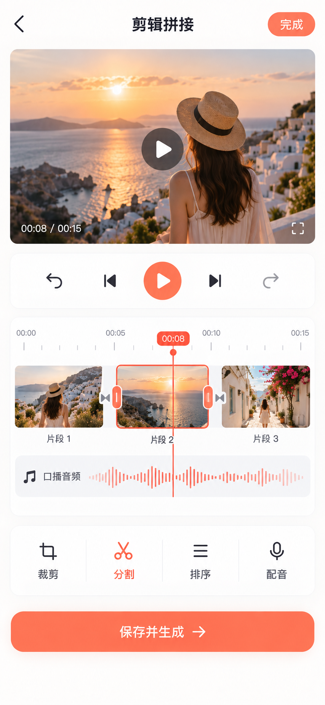
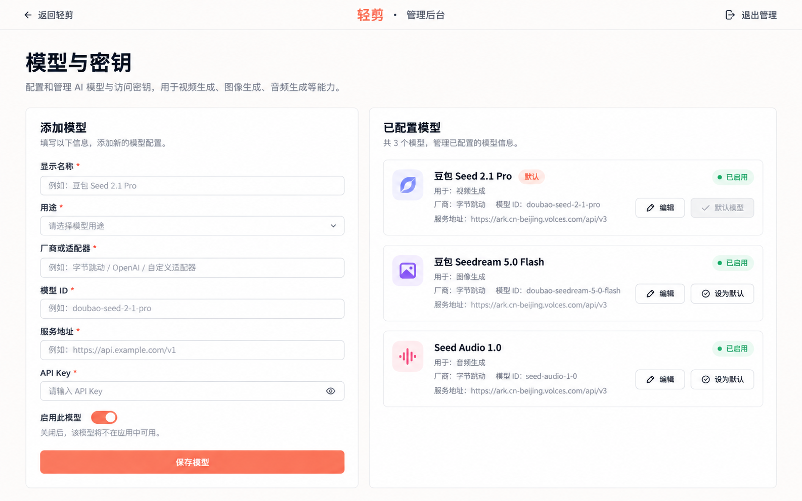

# 轻剪 H5 · 功能展示视觉稿

以下视觉稿延续 [首页视觉稿](h5-concept.png) 的暖白底色、珊瑚橙操作色与简洁对话布局。当前 H5 已实现对应的图片附件、口播试听和对话驱动剪辑流程；图片仅用于视觉方向，具体布局以运行中的页面为准。

## 1. 输入指令并附加本地图片

从本地素材选择图片后，输入框内显示图片缩略图和文件名，再输入“把这两段视频剪成15秒竖屏，用这张图片做封面，节奏轻快”。发送前可以移除附件。

## 2. 口播文案与独立音频试听

对话输出可阅读的口播文案，并生成单独的口播音频。音频卡片提供播放状态、波形进度和下载入口，与视频预览明确分开。

## 3. 点击视频查看剪辑拼接结果

点击成片后进入详情页：上方预览视频，下方时间线展示三个片段、口播音轨与播放头。图中的裁剪、分割、排序、配音工具应作为填入对话输入框的快捷指令；「保存并生成」是早期原型文案，正式版须替换为对话发送入口。用户发送消息后才由 Pi Agent 修改方案或生成成片。

## 4. 模型管理后台

管理后台延续轻剪的暖色视觉体系，提供管理员令牌登录、模型配置列表和新建/编辑表单。API Key 只在写入时输入，读取时显示配置状态。

## Agent 分段回复

每次请求对应一条 Agent 回复，由公开过程段落和独立最终总结组成。生成期间过程默认展开，模型问答的段落随响应更新，制片任务按真实执行阶段更新；重复进度刷新更新同一段落，不新增重复消息。工具调用记录在任务详情中独立折叠，展示脱敏参数、真实结果、失败原因和耗时，不展示模型内部思考或媒体数据。

任务成功或失败后过程自动收起，最终总结保持可见，结果卡与下载入口留在该回复下。点击“处理过程”可查看完整段落，详细文案与审查问题保留在其中；过长单段另提供“查看完整内容”。旧版长回复兼容折叠，不删除原文。失败结果明确标记未完成，并保留重试入口；重试建立本轮回复，避免沿用上轮失败总结。

在聊天底部阅读时，新段落跟随滚动；用户向上阅读历史时，不把视图强制拉回底部。过程和总结无需用户再次发送指令切换。
